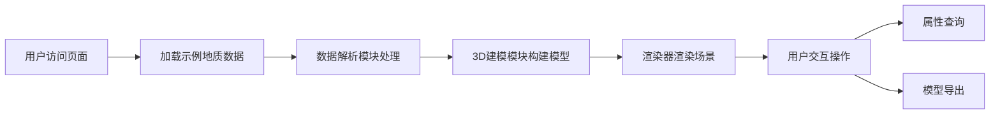

## 1. 产品概述

基于Three.js的交互式地下地质结构3D建模与可视化系统，为地质勘探、工程建设等领域提供直观的三维地质数据展示工具。支持地质层、断层、褶皱、钻井等多类型地质数据的三维可视化展示，提供丰富的交互操作和属性查询功能。

- 核心目标：将抽象的地质数据转化为直观的3D可视化模型，辅助地质分析与决策
- 目标用户：地质工程师、勘探人员、科研人员、工程设计师
- 产品价值：提升地质数据理解效率，降低专业门槛，支持导出复用

## 2. 核心功能

### 2.1 用户角色
| 角色 | 注册方式 | 核心权限 |
|------|----------|----------|
| 普通用户 | 无需注册，直接使用 | 查看3D模型、交互操作、属性查询、模型导出 |

### 2.2 功能模块
1. **3D视口**：地质模型渲染主区域，支持旋转、缩放、平移
2. **数据加载**：解析地质数据并构建3D模型
3. **交互控制**：鼠标/触屏操作、视角切换
4. **属性查询**：点击地质体查看详细属性信息
5. **模型导出**：支持导出3D模型文件
6. **控制面板**：图层显隐控制、显示参数调节

### 2.3 页面详情
| 页面名称 | 模块名称 | 功能描述 |
|----------|----------|----------|
| 主页面 | 3D视口 | 展示地质层、断层、褶皱、钻井的3D模型，支持旋转缩放平移 |
| 主页面 | 侧边控制面板 | 图层显隐切换、透明度调节、视角预设、导出按钮 |
| 主页面 | 属性信息面板 | 点击地质体后显示详细属性数据 |
| 主页面 | 顶部导航栏 | 系统标题、操作按钮、帮助信息 |

## 3. 核心流程

用户打开页面 → 系统加载示例地质数据 → 自动构建3D地质模型并渲染 → 用户通过鼠标/触屏交互旋转缩放查看 → 点击地质体查看属性 → 调整控制面板参数 → 导出模型文件

## 4. 用户界面设计

### 4.1 设计风格
- **主色调**：深蓝色系（#1a237e 主色，#0d47a1 辅助色），代表专业与科技感
- **辅助色**：地质色阶（棕褐色代表土层、灰蓝色代表岩层、绿色代表含水层）
- **背景**：深色渐变背景，营造沉浸式3D体验
- **字体**：使用现代无衬线字体，清晰专业
- **控件风格**：半透明玻璃态面板，圆角设计，柔和阴影
- **整体风格**：科技感、专业、沉浸式深色主题

### 4.2 页面设计概述
| 页面名称 | 模块名称 | UI元素 |
|----------|----------|--------|
| 主页面 | 3D视口 | 全屏3D画布、地质模型、光照效果、坐标轴指示器 |
| 主页面 | 左侧控制面板 | 图层列表、透明度滑块、视角预设按钮、导出按钮 |
| 主页面 | 右侧属性面板 | 属性标题、数据表格、关闭按钮 |
| 主页面 | 顶部导航栏 | 系统标题、操作图标、帮助按钮 |
| 主页面 | 底部状态栏 | 坐标显示、操作提示、性能信息 |

### 4.3 响应式
- Desktop-first设计，适配主流桌面分辨率
- 支持触屏设备，提供触屏手势操作（双指缩放、单指旋转）
- 小屏设备自动调整控制面板布局和尺寸

### 4.4 3D场景指引
- **环境**：深色空间背景，模拟地下勘探氛围，柔和的环境光配合定向光源
- **光照设置**：环境光提供基础照明，方向光模拟主光源产生阴影，点光源增强立体感
- **相机设置**：透视相机，初始45度俯视角，可360度旋转观察
- **构图**：地质模型居中展示，周围留有操作空间，底部有参考网格
- **交互**：鼠标拖拽旋转、滚轮缩放、右键平移，支持惯性效果
- **后处理**：抗锯齿、柔和阴影、物体选中高亮效果
- **性能**：合理控制面数，使用几何体实例化，保持60fps帧率
