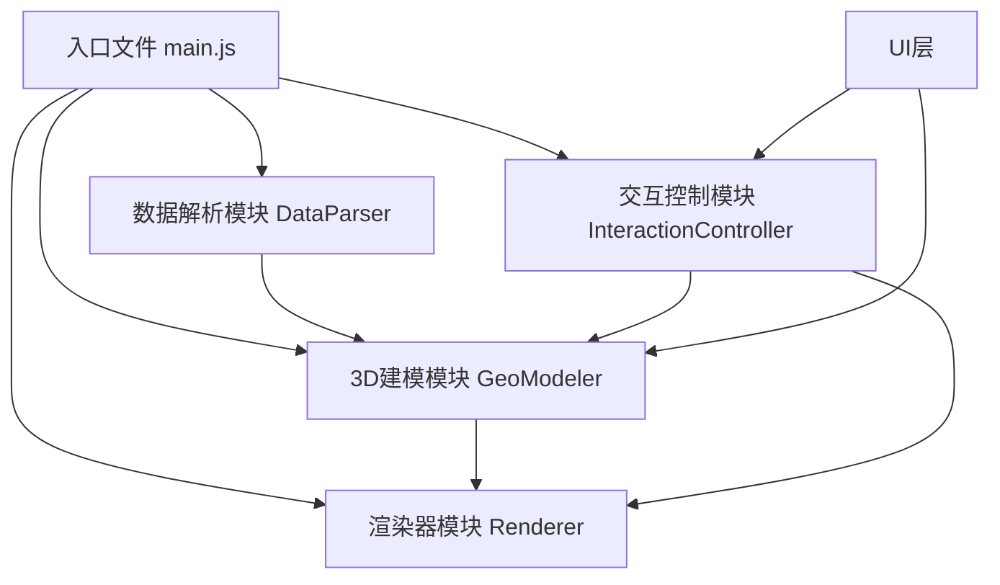
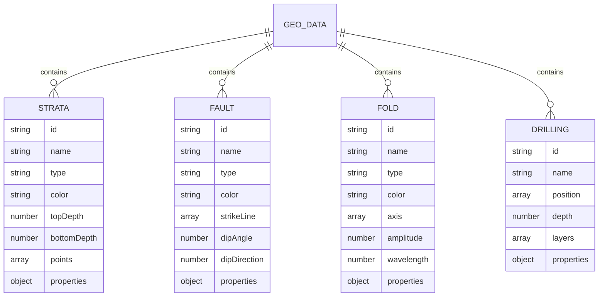

## 1. 架构设计

系统采用模块化架构，分为四个核心模块：数据解析、3D建模、渲染器、交互控制。模块间通过事件总线和接口调用进行通信，实现低耦合高内聚的设计。

## 2. 技术描述

- **前端框架**：原生 JavaScript (ES6+) + Three.js
- **模块系统**：ES Modules (type="module")
- **3D引擎**：Three.js r160+
- **样式**：原生 CSS3 + CSS 变量
- **包管理**：CDN方式引入，无需构建工具，可直接在浏览器运行
- **数据格式**：JSON格式地质数据

### 核心模块职责

| 模块 | 文件 | 职责 |
|------|------|------|
| 数据解析模块 | src/modules/DataParser.js | 解析地质数据JSON，验证数据格式，转换为内部数据结构 |
| 3D建模模块 | src/modules/GeoModeler.js | 构建地质层、断层、褶皱、钻井等3D模型 |
| 渲染器模块 | src/modules/Renderer.js | 管理Three.js场景、相机、渲染器、光照 |
| 交互控制模块 | src/modules/InteractionController.js | 鼠标/触屏交互、轨道控制、拾取检测 |
| 应用入口 | src/main.js | 初始化各模块，协调模块间通信 |
| 样式 | css/style.css | 全局样式、UI组件样式 |

## 3. 数据模型

### 3.1 地质数据结构

### 3.2 数据格式示例

地质数据采用JSON格式，包含地层、断层、褶皱、钻井四类数据。

## 4. 核心API

### 4.1 DataParser API
- `parse(data)` - 解析原始地质数据
- `validate(data)` - 验证数据格式
- `getStrata()` - 获取地层数据
- `getFaults()` - 获取断层数据
- `getFolds()` - 获取褶皱数据
- `getDrillings()` - 获取钻井数据

### 4.2 GeoModeler API
- `buildAll(data)` - 构建所有地质模型
- `buildStrata(strataData)` - 构建地层模型
- `buildFault(faultData)` - 构建断层模型
- `buildFold(foldData)` - 构建褶皱模型
- `buildDrilling(drillingData)` - 构建钻井模型
- `getObjectById(id)` - 根据ID获取3D对象
- `setLayerVisible(id, visible)` - 设置图层可见性
- `setLayerOpacity(id, opacity)` - 设置图层透明度

### 4.3 Renderer API
- `init(container)` - 初始化渲染器
- `render()` - 渲染一帧
- `animate()` - 启动动画循环
- `resize()` - 响应窗口大小变化
- `getScene()` - 获取场景对象
- `getCamera()` - 获取相机对象

### 4.4 InteractionController API
- `init(renderer, modeler)` - 初始化交互控制
- `enable()` - 启用交互
- `disable()` - 禁用交互
- `onPick(callback)` - 注册拾取回调
- `setViewPreset(preset)` - 设置视角预设
- `resetView()` - 重置视角
- `exportModel(format)` - 导出模型

## 5. 性能优化策略

- 合理控制几何体分段数，平衡质量与性能
- 使用材质共享，减少Draw Call
- 按需加载，支持大型地质数据的分级显示
- 射线拾取优化，使用包围盒预检测
- 帧率自适应，在低性能设备上自动降级
